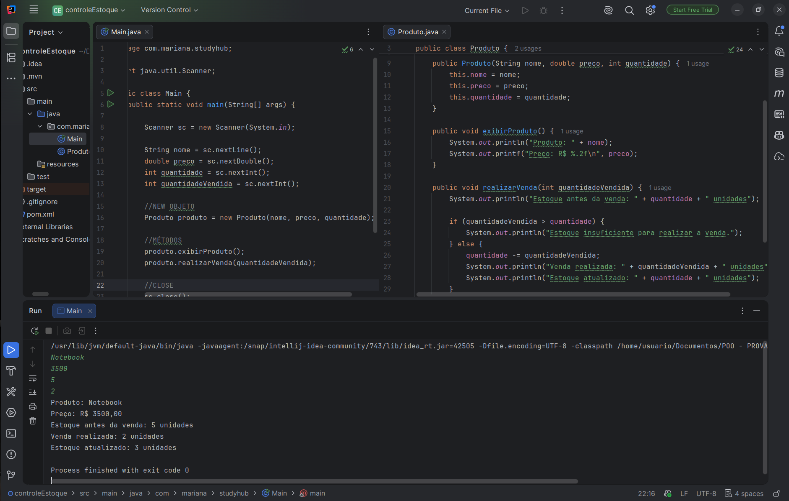

# 🧾 Controle de Estoque em Java

Projeto desenvolvido para a disciplina de Programação Orientada a Objetos.

## 📌 Descrição

O sistema permite cadastrar um produto, realizar uma venda e atualizar a quantidade em estoque, validando se há quantidade suficiente disponível.

## ⚙️ Funcionalidades

* Cadastro de produto (nome, preço e quantidade)
* Exibição das informações do produto
* Realização de venda
* Validação de estoque insuficiente
* Atualização automática do estoque

## 📸 Print

Aluna: Mariana Almeida

